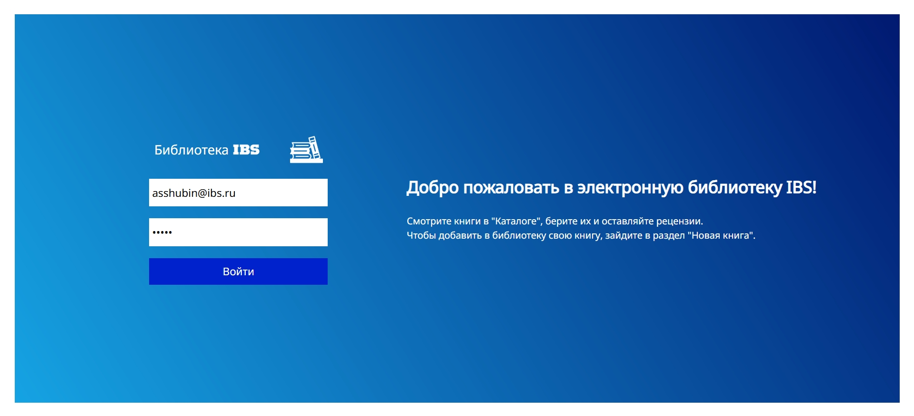
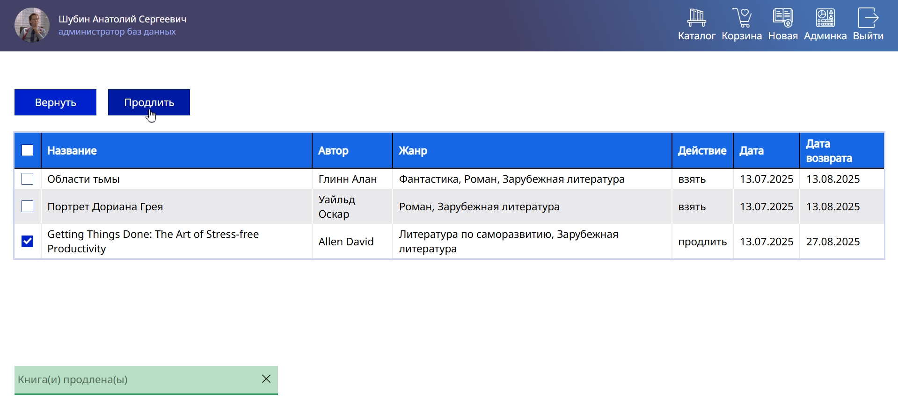

# E-library for IBS
This is a demo backend project for [ООО "ИБС Пермь"](https://ibs.ru/career/region/perm/)
The application allows you to checkout, extend and return books. Only employees of the company can sign in via a corporate e-mail and a password. Employee sees checkouted books at his cart. Also any user can search and sort books by a few parameters, add books, add a review of a book, get all reviews of a certain book and know the date of returning his books. Admin is able to look at the history and expired statuses. All names, e-mails, passwords in this work are fictitious. Any resemblance to real persons, living or dead, is purely coincidental.

# Pages
## Authorization page

## Catalog

## Sort books by a parameter

## Checkout any book

## Look at reviews

## Look at the checkouted books in your cart

## Add a review

## Look at your reviews after posting

## Add a new book

## Look at the books history of all employees

## Search specific info about the book by its id

## Look at the books employees have

## Look who didn't return books on time
